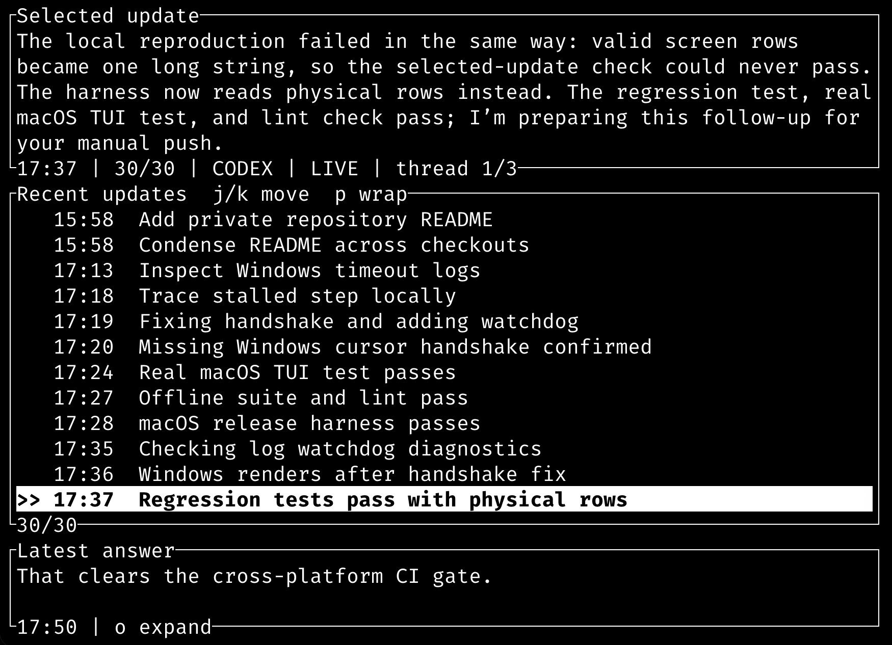

# Lowdown

**Follow your agent's work without reading a wall of text.**

Lowdown is a read-only terminal companion for local Codex sessions. It turns
long progress messages into short, scannable updates while keeping the original
text and latest answer a keypress away.

Run `lowdown` inside the project you want to follow. No paths or flags to
remember for everyday use.



*Lowdown following its own release work: scan the summaries, then inspect the original.*

## What You See

- A live update feed that takes most of the screen.
- Original text immediately, then cached or model-generated summaries as they arrive.
- The full selected message in an expandable reader.
- The latest answer kept separate from progress updates, with a compact preview.

Older updates load as you scroll back. Switch between the project's discovered
sessions without leaving the app. The TUI uses your terminal's background and
shows timestamps in your local timezone by default.

## Install And Run

From a checkout of this repository, with stable Rust and Cargo installed:

```sh
cargo install --locked --path . --bin lowdown
```

Make sure Cargo's bin directory is on your PATH, then enter a project with local
Codex sessions and run:

```sh
lowdown
```

No Python runtime is required. For prebuilt archives, checksum verification,
Windows setup, upgrades, and removal, see the [installation guide](docs/install.md).
Version 0.1.0 is currently a [release candidate](docs/releases/0.1.0.md).

## Controls

| Key | Action |
| --- | --- |
| `j` / `k` or arrows | Move through updates |
| Page Up / Page Down | Page updates or scroll the expanded reader |
| `h` / `l` | Switch between discovered sessions in this project |
| `i` | Expand or collapse the original message |
| `o` | Expand or collapse the latest answer |
| `p` | Toggle cropped rows and two-line wrapping |
| `q` or Ctrl+C | Quit |

To change projects, quit and run `lowdown` from the other project's directory.

## Summaries And Privacy

Model summaries use a compatible, signed-in Codex CLI through `codex exec`.
No separate API key is required. Calls use your existing account and may consume
subscription usage. Only batches of progress-message text are sent, not the
full transcript, tool output, or final answers. Summaries are cached locally.

To disable model calls and read the original updates:

```sh
LOWDOWN_SUMMARY_PROVIDER=fallback lowdown
```

Existing cached summaries may still appear. Model summaries can be wrong;
press `i` to check the original. Lowdown never edits your project or source logs.

## Scope And Documentation

V1 supports only the documented **local Codex rollout JSONL** format. It does
not yet support Claude, Gemini, a menu-bar app, or a background daemon.

- [Quickstart](docs/quickstart.md): commands, model settings, and cache locations.
- [Input contract](docs/input-contract.md): exact supported format and limitations.
- [Release notes](docs/releases/0.1.0.md): candidate features and verification requirements.
- [Release guide](docs/ops/releasing.md): build, test, and packaging procedures.

Licensed under the [MIT license](LICENSE).
